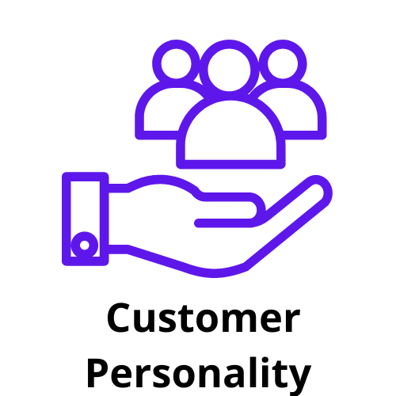

 <h1 align="center">Projeto de Clusterização - Customer Personality Analysis </h1>

  
 

Este é um projeto fictício. Aqui eu segui as recomendações do curso de Clusterização com Linguagem Python, ministrado pelo Caio Avelino.

# 1. Problema do negócio 
A Análise da Personalidade do Cliente é uma análise detalhada dos clientes ideais de uma empresa. Ele ajuda uma empresa a entender melhor seus clientes e facilita a modificação de produtos de acordo com as necessidades, comportamentos e preocupações específicas de diferentes tipos de clientes. Aqui, em vez de gastar dinheiro para comercializar um novo produto para cada cliente no banco de dados da empresa, uma empresa pode analisar qual segmento de cliente tem maior probabilidade de comprar o produto e, então, comercializar o produto apenas naquele segmento específico.

# 2. Descrição dos dados
Os dados para este projeto podem ser encontrados [na plataforma Kagle](https://www.kaggle.com/datasets/imakash3011/customer-personality-analysis). Abaixo seguem as definições para cada um dos atributos (feature):
| Feature | Definição |
|---|---|
|People|
|ID | Customer's unique identifier|
|Year_Birth | Customer's birth year|
|Education | Customer's education level|
|Marital_Status | Customer's marital status|
|Income | Customer's yearly household income|
|Kidhome | Number of children in customer's household|
|Teenhome| Number of teenagers in customer's household|
|Dt_Customer| Date of customer's enrollment with the company|
|Recency| Number of days since customer's last purchase|
|Complain| 1 if the customer complained in the last 2 years, 0 otherwise|
|Products|
|MntWines| Amount spent on wine in last 2 years|
|MntFruits| Amount spent on fruits in last 2 years|
|MntMeatProducts| Amount spent on meat in last 2 years|
|MntFishProducts| Amount spent on fish in last 2 years|
|MntSweetProducts| Amount spent on sweets in last 2 years|
|MntGoldProds| Amount spent on gold in last 2 years|
|Promotion|
|NumDealsPurchases| Number of purchases made with a discount|
|AcceptedCmp1| 1 if customer accepted the offer in the 1st campaign, 0 otherwise|
|AcceptedCmp2| 1 if customer accepted the offer in the 2nd campaign, 0 otherwise|
|AcceptedCmp3| 1 if customer accepted the offer in the 3rd campaign, 0 otherwise|
|AcceptedCmp4| 1 if customer accepted the offer in the 4th campaign, 0 otherwise|
|AcceptedCmp5| 1 if customer accepted the offer in the 5th campaign, 0 otherwise|
|Response| 1 if customer accepted the offer in the last campaign, 0 otherwise|
|Place|
|NumWebPurchases| Number of purchases made through the company’s website|
|NumCatalogPurchases| Number of purchases made using a catalogue|
|NumStorePurchases| Number of purchases made directly in stores|
|NumWebVisitsMonth| Number of visits to company’s website in the last month|

# 3. Planejamento e solução

 A solução do problema se dará com base modelo apresentado no sucro, com alguns passos que foram adaptados. Apliquei um modelo de Machine Learning não supervisionado para entender os gostos e preferências dos clientes:

# 4. Ferramentas e Métodos utilizados

* Python 3.10
* Pandas, Matplotlib, Seaborn and Sklearn.
* Jupyter Notebook and VSCode.
* Git and Github.
* Exploratory Data Analysis (EDA).
* Kmeans

# 6. Principais resultados
* Cluster 0: Grupo com maior valor e menor número de clientes. Eles têm alta renda e maior escolaridade, são os que mais compram e têm a maior média de recebimento de todos os grupos. Eles tendem a não visitar o site da empresa com tanta frequência ou comprar por meio de promoções, preferindo comprar por catálogos e diretamente na loja. Suas categorias favoritas são carne e vinho. A maioria não tem filhos em casa e são clientes cadastrados há muito tempo.

* Cluster 1: Trata-se de um grupo jovem de menor poder aquisitivo, o menos ativo de todos. A empresa tem que ter cuidado porque eles estão churn e não estão comprando tanto quanto antes. É o grupo menos propenso a aceitar campanhas publicitárias. É uma oportunidade importante para a empresa divulgar produtos mais voltados para o público infantil. Grupo que mais compra por promoções (%). Eles gostam de fazer compras em uma loja. São eles que visitam o site com mais frequência. Eles gostam de canetas douradas mais do que os outros clusters de maior valor.

* Cluster 2: Clientes mais jovens, com menor poder aquisitivo, mas os mais ativos dentro da empresa. É o grupo que levou menos tempo. Os clientes gostam de comprar em saldos, nas lojas e no site. Eles preferem mais produtos de ouro do que os outros clusters de maior valor.

* Cluster 3: É um grupo que faz muitas compras, mas com ticket médio bem menor que o grupo anterior, mas ainda trazendo muito faturamento para a empresa. Os clientes têm um salário anual relativamente alto, são mais velhos e geralmente têm uma criança em casa. É o grupo que mais aprecia a categoria de vinhos e tem o maior número de clientes.

---
# Contatos
 

[e-mail](karinnasantos0@gmail.com)

[Portifólio de projetos](https://karinnasantos.github.io/project_portfolio/)